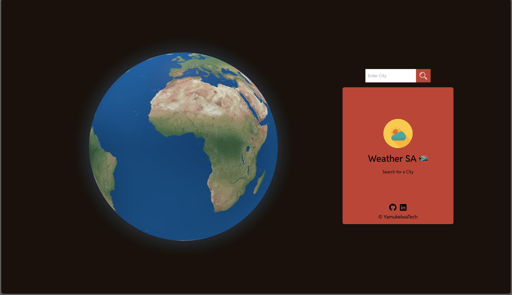

#### WeatherSA

###### Date Started: 05/06/2024

###### Last Updated: 06/19/2024

###### Deployment: Netlify

###### Get Started with React: [what to do ?](https://github.com/fullstacktutorials/install-reactjs)

---

###### Tech Stack: HTML5 Tailwind Reactjs Threejs

---

##### Welcome to WeatherSA! If you're here, you're checking out how to make your weather app and you can rest assured that you come to the right place. Feel free to explore, and remember, the code is yours to adapt and use however you like. Enjoy!

---

---

###### Features:

##### - Responsive design that adapts to different screen sizes.

##### - Tailwind CSS for styling.

##### - Detailed sections about weather, button, api etc.

###### Process:

##### - Started with searching on github for inspiration

##### - Found a repo with the orginal codebase and downloaded the zip to work on it, it is my first time touching on three js.

##### - Read the documentation and had an okay understanding to go forward.

##### - Configured the Tailwind to my styling.

##### - Edited the Componments and improved some areas.

###### Learnings:

##### - Gained a new understanding of three.js.

##### - Learned how to work on three.js.

##### - Improved skills in Tailwind.

##### - Gained a stronger understanding in reactJs.
